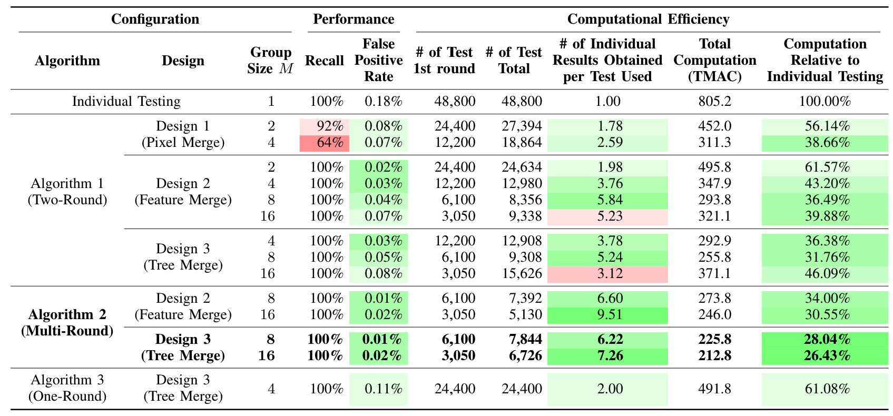
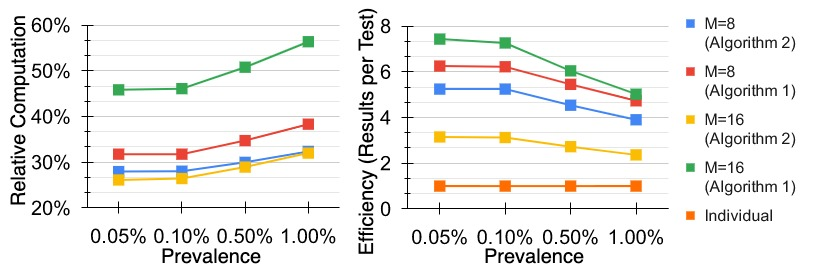
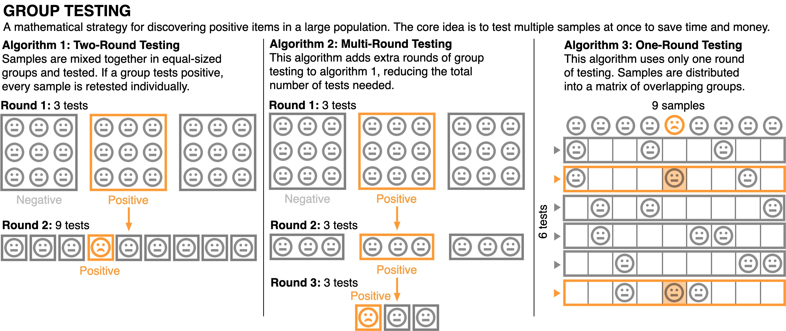
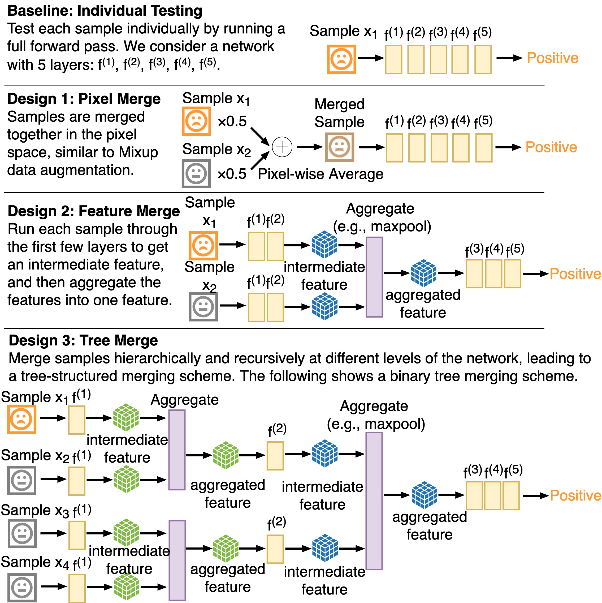

# Neural Group Testing to Accelerate Deep Learning


[](https://github.com/Weixin-Liang/NeuralGroupTesting/blob/master/LICENSE)
[](https://arxiv.org/abs/2011.10704)
[](https://www.python.org/downloads/release/python-360/)
[](https://shields.io/)

This repo provides the PyTorch source code of our paper: 
[Neural Group Testing to Accelerate Deep Learning](https://arxiv.org/abs/2011.10704) (ISIT 2021). 
[[PDF]](https://arxiv.org/pdf/2011.10704.pdf)
[[Code]](https://github.com/Weixin-Liang/NeuralGroupTesting/)


```
@inproceedings{liang2021neural,
  author    = {Weixin Liang and James Zou},
  title     = {Neural Group Testing to Accelerate Deep Learning},
  booktitle = {{IEEE} International Symposium on Information Theory, {ISIT} 2021},
  publisher = {{IEEE}},
  year      = {2021}
}
```


## Abstract
*Recent advances in deep learning have made the use of large, deep neural networks with tens of millions of parameters. The sheer size of these networks imposes a challenging computational burden during inference. Existing work focuses primarily on accelerating each forward pass of a neural network. Inspired by the group testing strategy for efficient disease testing, we propose neural group testing, which accelerates by testing a group of samples in one forward pass. Groups of samples that test negative are ruled out. If a group tests positive,  samples in that group are then retested adaptively. A key challenge of neural group testing is to modify a deep neural network so that it could test multiple samples in one forward pass. We propose three designs to achieve this without introducing any new parameters and evaluate their performances. We applied neural group testing in an image moderation task to detect rare but inappropriate images. We found that neural group testing can group up to 16 images in one forward pass and reduce the overall computation cost by over 73% while improving detection performance. Our implementation is available at https://github.com/Weixin-Liang/NeuralGroupTesting/*


## Reproducing Results using Cached Predictions [Quick]
We cache the predictions of the neural network in pickle files, so that one can reproce the experiment results quickly with minimum dependencies (requiring only numpy and sklearn). To reproduce the computational cost and performance of different configurations under different prevalance levels, please run 
```sh
cd ./code
python gather_results.py
```
Note that you don't need to download and generate the dataset. In addition, K=M-1 in the code, which is group size minus 1. 
[gather_results.py](code/gather_results.py) would reproduce the following results: 

<p align='center'>
  
  
Table 1: Computational savings and performance improvement achieved by neural group testing with various configurations. 
</p>

<p align='center'>
  
  
Figure 3: Relative computation and test efficiency under different prevalence. Evaluated with Design 3 (Tree Merge) with various group size M and algorithms. 
</p>

## Understanding the Code Structure
### Quick Reproducing and Group Testing Algorithms
[gather_results.py](code/gather_results.py) provides a quick way to reproduce results with minimum dependencies. It also implements different group tesint algorithms (algorithm 1, 2, 3 in Figure 1)
<p align='center'>
  
  
Figure 1: Overview of group testing, a strategy that is used in efficient disease testing. The core idea is to test multiple samples at once to save time and </p>
money. 


### Neural Group Testing Designs
Neural group testing only requires a few lines of change of code to the orignal model. [resnet_design2/my_resnet.py](code/resnet_design2/my_resnet.py) and [resnet_design3/my_resnet.py](code/resnet_design3/my_resnet.py) implement design 2 and design 3 in Figure 2. The implementation is built upon the [PyTorch Resnet](https://github.com/pytorch/vision/blob/master/torchvision/models/resnet.py). 


<p align='center'>
  
  
Figure 2: Three neural network designs of neural group testing to test multiple samples with one forward pass.
</p>


### Calculating Computation Cost
[estimate_flops.py](code/estimate_flops.py) calculates the computation cost of the forward pass of different designs. 
It is based on the [ptflops](https://github.com/sovrasov/flops-counter.pytorch) package. 


### Combining with Existing Acceleration Methods
[network_pruning.py](code/network_pruning.py) implements neural network pruning. It is based on the [torch.nn.utils.prune](https://pytorch.org/docs/stable/generated/torch.nn.utils.prune.global_unstructured.html) functionality. 


## Reproducing from scratch

### Full Dependencies
To reproduce the results from scratch, you need to install the full dependencies. Run the following commands to create a conda environment):
```bash
conda create -n neuralgrouptesting python=3.6
conda activate neuralgrouptesting
conda install pytorch torchvision torchaudio cudatoolkit=10.2 -c pytorch
conda install matplotlib scipy
conda install -c conda-forge scikit-learn 
conda install -c conda-forge transformers
conda install pandas
```
Please check [requirements.txt](requirements.txt) or [requirements.yml](requirements.yml) for additional details about the dependencies (Note that you don't need to install all of them). 


### Downloading ImageNet
Please refer to [here](https://github.com/pytorch/examples/tree/master/imagenet). 

### Generate Group Testing ImageNet
[data/dataset_init_scripts/create_dataset_from_imagenet.py](data/dataset_init_scripts/network_pruning.py) builds the group testing dataset (firearm image moderation) based on ImageNet. 

```sh
cd data/dataset_init_scripts/
python create_dataset_from_imagenet.py > create_dataset_from_imagenet.sh && sh create_dataset_from_imagenet.sh
```


### Training Models
The code is built upon the [official PyTorch ImageNet training example](https://github.com/pytorch/examples/tree/master/imagenet). The following command enables distributed training: 
```py
CUDA_VISIBLE_DEVICES=0,1 python main.py --background-K 0  --data /data/weixin/data/GroupTestingDataset --pretrained --lr 0.001  --batch-size 64 -a resnext101_32x8d --task-num 2 --log-name DEBUG.log --output_dir ResNeXt101FullK0 --dist-url 'tcp://127.0.0.1:7101' --dist-backend 'nccl' --multiprocessing-distributed --world-size 1 --rank 0 
```

To kill distributed training, you need to use the following command instead of Ctrl+C: 
```sh
# Appendix: Kill Distributed: 
kill $(ps aux | grep main.py | grep -v grep | awk '{print $2}')
```

### Generating Prediction Cache
Assume that the path of the group testing dataset is */data/weixin/data/GroupTestingDataset*, and the model checkpoint is */home/weixin/poolTest/neuralPoolTest/code/ResNeXt101FullK7_TREE024_G2/checkpoint.pth.tar*, the following command run the inference and cache the predictions: 

```sh
CUDA_VISIBLE_DEVICES=1 python main.py --background-K 7 --data /data/weixin/data/GroupTestingDataset --pretrained --lr 0.001  --batch-size 15 -a resnext101_32x8d --task-num 2 --log-name DEBUG.log --output_dir VAL_DEBUG_P0.01pct --evaluate --resume /home/weixin/poolTest/neuralPoolTest/code/ResNeXt101FullK7_TREE024_G2/checkpoint.pth.tar
```

Finally, please refer to the previous section and use [gather_results.py](code/gather_results.py) to generate results. 

